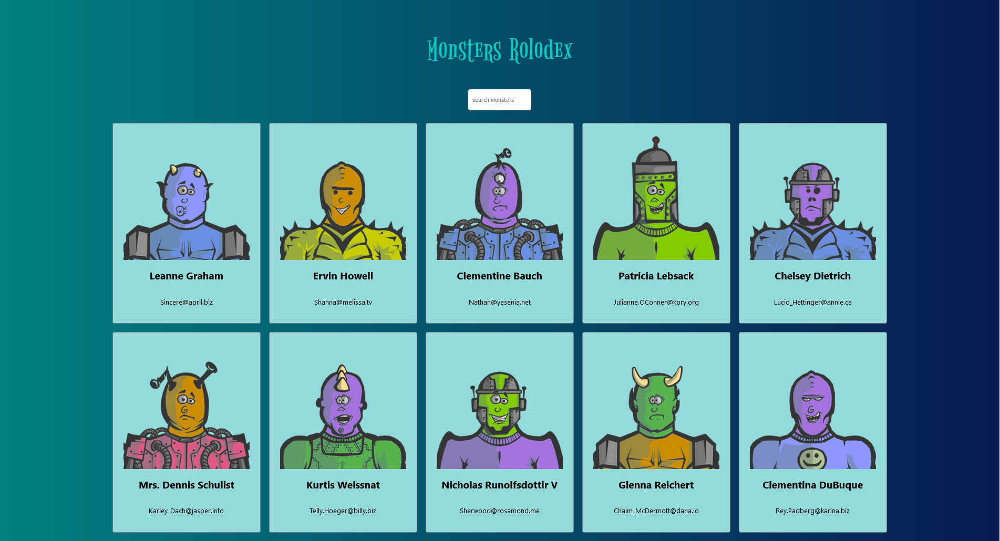

# Monsters Rolodex

The Monsters Rolodex project is part of the Complete React Developer course by Zero To Mastery. This interactive app demonstrates foundational React concepts by allowing users to search for "monsters" (mock users fetched from an API) in a responsive and visually appealing interface.

## Table of contents

- [Monsters Rolodex](#monsters-rolodex)
  - [Table of contents](#table-of-contents)
  - [Overview](#overview)
    - [Screenshot](#screenshot)
    - [Links](#links)
    - [Built with](#built-with)
    - [What I learned](#what-i-learned)
    - [Continued development](#continued-development)
    - [Useful resources](#useful-resources)
  - [Author](#author)
  - [Acknowledgments](#acknowledgments)

## Overview

The main objectives of the project are to:
- Fetch a list of users from an API and display them as "monsters."
- Enable users to search for monsters by their names using a dynamic search box.
- Provide a responsive design that adjusts seamlessly across devices.

### Screenshot



### Links

- Solution URL: [GitHub Repository](https://github.com/dantvi/monsters-rolodex)
- Live Site URL: [DT Code](https://monsters-rolodex.dtcode.se/)

### Built with

- React Class Components: Employed React's class components for state management and rendering.
- API Integration: Used the JSONPlaceholder API to fetch user data.
- CSS Modules: Scoped and organized styles using modular CSS files.
- Responsive Design: Ensured usability across various devices with flexible layouts and media queries.

### What I learned

This project helped me enhance my understanding of:
- React State Management: Managed state using React's class component structure. Dynamically updated the searchField and filtered monsters based on user input.
- Component Architecture: Organized reusable components (e.g., Card, CardList, SearchBox).
- API Integration: Retrieved and displayed dynamic data using fetch within the componentDidMount lifecycle method.
- Styling for Interactivity: Implemented hover effects for cards and ensured responsiveness with media queries.

Here’s an example of state filtering and rendering:

```jsx
const filteredMonsters = this.state.monsters.filter((monster) =>
  monster.name.toLowerCase().includes(this.state.searchField)
);
```

### Continued development

In future projects, I plan to:
- Refactor the app to use React Hooks for a functional component structure.
- Explore state management with external libraries like Redux or Context API.
- Integrate animations to enhance user interactions, such as on card hover or search input changes.

### Useful resources

- [React Documentation](https://reactjs.org/docs/getting-started.html) - Comprehensive resource for understanding React concepts and class components.
- [JSONPlaceholder API](https://jsonplaceholder.typicode.com/) - Provided mock user data for the app.

## Author

- GitHub - [@dantvi](https://github.com/dantvi)
- LinkedIn - [@danieltving](https://www.linkedin.com/in/danieltving/)

## Acknowledgments

Thanks to the instructors at Zero To Mastery for creating a clear and comprehensive curriculum. The Monsters Rolodex project was an excellent introduction to React Class Components and state management.
